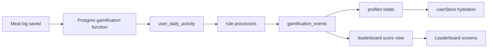

# Phase 1 Gamification Plan

## Current State

Gamification is mostly present in UI and mock data, but not yet persisted. The existing app already has the right surfaces in `[src/screens/main/HomeScreen.tsx](src/screens/main/HomeScreen.tsx)`, `[src/screens/main/ProfileScreen.tsx](src/screens/main/ProfileScreen.tsx)`, `[src/screens/main/LeaderboardScreen.tsx](src/screens/main/LeaderboardScreen.tsx)`, and `[src/screens/main/RewardsScreen.tsx](src/screens/main/RewardsScreen.tsx)`. Meal logging is real through `[src/services/mealLogService.ts](src/services/mealLogService.ts)`, and local day boundaries already use `profiles.timezone`.

The key implementation gap is persistence: `[supabase/migrations/0001_phase0_schema.sql](supabase/migrations/0001_phase0_schema.sql)` has `profiles`, `foods`, and `meal_logs`, but no XP, points, ledger, streak state, or leaderboard scoring tables. Existing constants in `[src/data/mockData.ts](src/data/mockData.ts)` define the starting economy: `+50 XP` for meal logging, `+10 pts` for logging a meal, `+25 pts` for hitting daily protein, `+100 pts` for a 7-day streak, and `+250 pts` for winning a challenge.

## Product Rule Direction

The important product direction is that there should not be only one hardcoded way to compete. Phase 1 should build the rule engine for individual users first, then leagues can later choose which rules are active. A user or league should eventually be able to compete on meal count, protein consistency, macro accuracy, streak behavior, or a combination of those rules.

Use three separate concepts so the system stays understandable:

- `XP` is lifetime progression. It never decreases and drives level/title UI.
- `Points` are spendable rewards currency. They increase from healthy actions and decrease on redemption.
- `Event score` is the configurable leaderboard/league metric derived from selected rule modules. It does not drop when a user spends points.

Recommended Phase 1 XP and level rules:

- Award `+50 XP` once per confirmed meal log.
- Store `xp_total` on `profiles` for fast reads, but write every XP award into the event ledger.
- Keep the existing flat Phase 1 curve: `level = floor(xp_total / 500) + 1`.
- Keep existing titles from `[src/data/mockData.ts](src/data/mockData.ts)` for levels 1-10; levels above 10 can display `Legend` until a later prestige design.
- Strong alternative: use an increasing curve such as `500, 650, 850, 1100...` if you want level-ups to slow down over time. I do not recommend that for Phase 1 because the current UI and constants already assume 500 XP steps.

Recommended Phase 1 point and score rules:

- `meal_logged`: `+10 points`, `+50 XP`, and a configurable score delta.
- `meal_count_goal_hit`: score/points awarded when the user logs the required number of meals for the local day, such as 1, 2, or 3 meals.
- `daily_protein_goal_hit`: `+25 points` by default, scored once per local day when protein reaches the user's goal.
- `daily_macro_accuracy_hit`: scored once per local day when selected macros are within configured ranges.
- `streak_milestone`: `+100 points` by default at configurable milestones such as 7, 14, 21, and 30 days.
- `challenge_or_league_win`: `+250 points` by default, awarded once when a challenge or league is finalized.
- `reward_redeemed`: negative points only; no negative XP and no negative event score.

Recommended macro accuracy rule:

- Start with configurable tolerance bands instead of exact targets, because exact macro matching is too brittle.
- For protein, require at least `100%` of goal by default.
- For calories, score success when the user is between `90%` and `110%` of goal.
- For carbs and fats, score success when the user is between `80%` and `120%` of goal.
- Strong alternative: use a graded score where closer macro accuracy earns more points. That is more flexible long-term, but the first implementation should use pass/fail bands so it is easy to test.

Recommended individual streak rules:

- A streak day qualifies when the user satisfies the currently selected individual streak rule for that local calendar day.
- Start with `at_least_one_meal_logged` as the default active streak rule.
- Add rule modules one by one: `required_meal_count`, then `protein_goal_hit`, then `macro_accuracy_hit`.
- The local day is computed from `profiles.timezone`, matching the existing day-window approach in `[src/services/mealLogService.ts](src/services/mealLogService.ts)`.
- Timezone changes affect future days only; past ledger and activity dates are not rewritten.
- No grace period for Phase 1. Strong alternative: allow a 3 AM grace period for college users, but it adds edge cases and should wait until behavior shows users need it.

Recommended leaderboard and future league rules:

- Phase 1 ranks individual users by selected rule modules over a selected date window.
- Support duration options of `2 weeks`, `3 weeks`, and `1 month`; avoid a 1-week default because it is too short for meaningful nutrition habits.
- The default individual leaderboard should use a 2-week window and enable meal logging, protein completion, and streak scoring.
- Friends and My Team tabs should use the same scoring pipeline once friendships and leagues/challenges are backed by Supabase.
- League creation later should store selected rule toggles and duration, then reuse the individual rule processors instead of introducing separate league-only logic.
- Scoring windows should use UTC for cross-user ranking boundaries, while each user's daily rule qualification remains based on their local timezone.

## Data Model

Add one migration after the existing nutrition migrations.

Extend `profiles` with denormalized fields for fast app reads:

- `display_name`, `university`, `goal_type`, `avatar_url`
- `xp_total`, `points_balance`
- `current_streak`, `longest_streak`, `last_streak_local_date`
- `total_meals_logged`, `challenges_won`

Add `gamification_events` as the source of truth for XP, points, and leaderboard scoring:

- `id`, `user_id`, `event_type`
- `xp_delta`, `points_delta`, `leaderboard_delta`
- `source_type`, `source_id`, `source_local_date`
- `timezone`, `metadata`, `created_at`
- unique index on `(user_id, event_type, source_type, source_id)` where applicable, so retries cannot double-award

Add `user_daily_activity` to make streak and daily-goal awards idempotent:

- `user_id`, `local_date`, `timezone`
- `meal_count`, `protein_g`, `calories`, `carbs_g`, `fat_g`
- `meal_count_goal_met`, `protein_goal_met`, `macro_accuracy_goal_met`
- `qualified_for_streak`, per-rule awarded timestamps
- unique index on `(user_id, local_date)`

Add `gamification_rule_sets` so selected scoring options are data-driven:

- `id`, `owner_user_id`, `scope`, `name`, `duration_days`
- `rules` JSON containing toggles and thresholds for meal count, protein, macro accuracy, streaks, XP, and points
- `starts_at`, `ends_at`, `created_at`
- For Phase 1, use a default individual rule set per user or a system default; future leagues can create their own rule sets.

Add leaderboard read models:

- `leaderboard_scores` view or materialized view: sum score deltas by user, rule set, and configured event window.
- `leaderboard_entries` view: joins score with profile fields, streak, and active rule set.
- Optional Phase 1.1: materialize if realtime/global rankings become slow.

Add or prepare support tables for leaderboard filters:

- `friendships` for Friends leaderboard.
- `challenges`, `challenge_participants`, and `challenge_goals` for My Team leaderboard and challenge win awards.
- `rewards` and `user_rewards` only if reward redemption is included in this Phase 1 slice; otherwise keep the ledger ready for redemption later.

## Awarding Flow

Use database functions/triggers for invariants, then expose simple client services.

Implement `process_meal_gamification(meal_id)` in SQL or a Supabase RPC:

- Load the meal, profile timezone, and goals.
- Compute the meal's local date.
- Upsert `user_daily_activity` for that date.
- Insert the meal event: `+50 XP`, `+10 points`, and the configured event-score delta.
- Evaluate enabled individual rule modules for the active rule set.
- If meal count reaches the configured daily target for the first time, insert a meal-count-goal event.
- If daily protein total crosses the configured goal for the first time, insert the protein-goal event.
- If daily macros enter the configured tolerance bands for the first time, insert the macro-accuracy event.
- Recompute streak state from the selected streak qualification rule and insert milestone events when applicable.
- Update profile rollups from inserted events.

Prefer a database trigger after `meal_logs` insert for Phase 1 because the current client inserts meals directly through Supabase. If later we move to an edge function for all meal confirmation, the function can call the same RPC.

Implement rule modules one by one:

1. Base meal logged event: XP, points, and ledger integrity.
2. Meal count rule: configurable required meals per local day.
3. Protein rule: daily protein completion, awarded once per local day.
4. Macro accuracy rule: pass/fail tolerance bands for calories, protein, carbs, and fats.
5. Streak rule: selected daily qualification rule and milestone awards.
6. Event window scoring: 2-week, 3-week, and 1-month windows for individual leaderboards, later reused by leagues.

## Frontend Integration

Create services that mirror the existing Supabase service style:

- `[src/services/gamificationService.ts](src/services/gamificationService.ts)` for current gamification profile, event history, and optional manual refresh.
- `[src/services/ruleSetService.ts](src/services/ruleSetService.ts)` for reading/updating individual rule toggles and thresholds.
- `[src/services/leaderboardService.ts](src/services/leaderboardService.ts)` for global, friends, team, and individual rule-set leaderboard queries.
- `[src/services/rewardService.ts](src/services/rewardService.ts)` if reward redemption is included now.

Update auth/profile hydration:

- Replace the hardcoded zeroed gamification user in `[App.tsx](App.tsx)` with a load from `profiles`.
- Keep `[src/store/userStore.ts](src/store/userStore.ts)` as UI state, but treat Supabase as the source of truth.
- Remove client-only `addXp`, `addPoints`, and `incrementStreak` as authority; use them only for optimistic animation if needed.

Update post-log feedback:

- After `[src/services/mealLogService.ts](src/services/mealLogService.ts)` logs a meal, fetch the gamification result or latest profile.
- Mount `[src/components/FloatingXP.tsx](src/components/FloatingXP.tsx)` on successful log.
- Show a toast with XP, points, active rule progress, streak change, and protein/macro progress.
- Refresh Home/Profile leaderboard-related state on focus.

Replace mock-backed screens gradually:

- `[src/screens/main/ProfileScreen.tsx](src/screens/main/ProfileScreen.tsx)` reads real XP, level, points, streak, longest streak, total meals.
- `[src/screens/main/RewardsScreen.tsx](src/screens/main/RewardsScreen.tsx)` reads real points balance and writes redemption events only through the backend.
- `[src/screens/main/LeaderboardScreen.tsx](src/screens/main/LeaderboardScreen.tsx)` reads leaderboard services instead of `[src/data/mockData.ts](src/data/mockData.ts)`.
- Add a simple individual rule settings surface once the first two rule modules work, so meal count/protein toggles can be tested before league creation exists.
- Keep seeded demo rows for visual richness, but load them from Supabase seed data rather than local constants.

## Build Order

1. Fix or account for the existing fat-goal schema mismatch noted in `[Next steps (as of 06-15-26).md](Next%20steps%20(as%20of%2006-15-26).md)` so daily goal logic has reliable profile data.
2. Add the gamification migration: profile fields, event ledger, daily activity, rule sets, views, RLS, and seed data.
3. Implement the base meal logged event and verify idempotency using existing `client_request_id` behavior.
4. Implement the meal count rule and test configurable daily targets.
5. Implement the protein rule and test once-per-local-day awards.
6. Implement the macro accuracy rule and test tolerance bands independently.
7. Implement streak recomputation using the selected individual qualification rule.
8. Implement 2-week, 3-week, and 1-month score windows for individual leaderboards.
9. Add Supabase services for gamification profile, rule sets, and leaderboards.
10. Hydrate `userStore` from Supabase instead of hardcoded defaults in `[App.tsx](App.tsx)`.
11. Replace mock leaderboard data with real configurable individual/global queries, then prepare friends/team filters.
12. Replace reward point balance and redemption with ledger-backed reads/writes if rewards are in scope.
13. Add post-log feedback: floating XP, points gained, active rule progress, streak update, and protein/macro progress toast.
14. Add seed data for demo users, leaderboard rows, challenges/leagues, and rewards.
15. Add focused tests/manual verification scripts for duplicate meal retries, timezone boundaries, each rule module, combined scoring, point ledger balances, reward redemption, and leaderboard ranking.

## Acceptance Criteria

Phase 1 is complete when:

- A signed-in user logs a meal and receives exactly one `meal_logged` gamification event, even if the request is retried.
- XP persists, level/title derive consistently, and Profile/Home show the same values after app restart.
- Points balance is derived from ledgered earn and spend events, with no client-only deductions.
- Meal count, protein, and macro accuracy rule modules can each be enabled, disabled, and tested independently for an individual user.
- Daily meal count, protein, and macro accuracy awards happen at most once per local day per rule set.
- Streaks use the selected qualification rule plus the profile timezone, and update correctly across midnight and timezone changes.
- Individual score windows support 2 weeks, 3 weeks, and 1 month.
- The global leaderboard ranks users by selected event score and shows the current user pinned as designed.
- Friends and My Team tabs either show real filtered data when support tables exist or clear seeded/empty Phase 1 states.
- Reward redemption, if included, creates a negative ledger event and a `user_rewards` row atomically.
- Seed/demo data can demonstrate the full loop: log meal -> earn XP/points -> maintain streak -> climb leaderboard -> redeem/view reward.