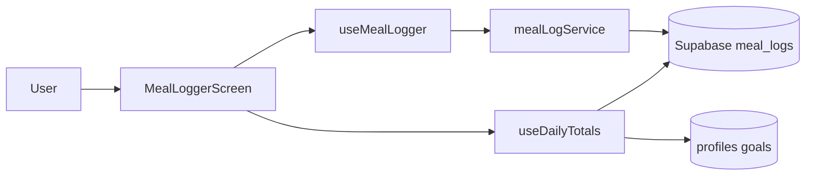

# Real Data Wiring Plan

## Goal
Make the nutrition core loop use persisted Supabase data wherever it matters: auth profile, goals, meal logs, today totals, and dashboard meal display. Mock data can remain only for explicitly future/demo-only features like challenges, rewards, leaderboard, achievements, and team activity.

## Current Real Data Path

This path already exists and should become the source for Home/Profile/Goals instead of the demo stores.

## Implementation Steps

1. Centralize persisted profile access in [src/services/profileService.ts](src/services/profileService.ts)
- Keep `updateOnboardingProfile()`.
- Add a profile read helper that returns `timezone`, goal fields, and display username for the authenticated user.
- Add a reusable goal update helper for later goal edits, mapping UI fields to `profiles.goal_*` columns.
- Preserve the existing database trigger path for profile creation.

2. Make profile goals database-backed
- Update [src/screens/main/EditGoalsScreen.tsx](src/screens/main/EditGoalsScreen.tsx) so Save writes to `profiles`, not just `useUserStore`.
- After save, update local state only as a UI cache or navigate back and let screens refetch.
- Handle loading/error states so failed saves do not pretend to persist.

3. Replace Home macro data with persisted data
- Update [src/screens/main/HomeScreen.tsx](src/screens/main/HomeScreen.tsx) to use `useDailyTotals(new Date())` instead of `useMacroStore` and `DEMO_TODAYS_MEALS`.
- Map `DailyTotals` fields to the current `MacroRing` props:
  - `calories` -> `totals.calories`
  - `protein` -> `totals.proteinG`
  - `carbs` -> `totals.carbsG`
  - `fats` -> `totals.fatG`
- Map profile goals from `useDailyTotals().goals` instead of `useUserStore().dailyGoals`.
- Show loading, error, and empty-meals states clearly.

4. Adapt persisted meal rows to the existing meal card
- Either update [src/components/FoodLogItem.tsx](src/components/FoodLogItem.tsx) to accept `src/services/mealLogService.ts` meals directly, or add a small adapter in `HomeScreen`.
- Recommended: update `FoodLogItem` to use the persisted shape directly, because future screens should not depend on the old demo meal type.
- Mapping:
  - `freeText` -> display name
  - `eatenAt` -> logged time
  - `proteinG`, `carbsG`, `fatG` -> macros
  - `source` can default to `manual` unless optional source metadata is exposed in the returned row later.

5. Remove nutrition-critical dependencies on mock stores
- Stop using [src/store/macroStore.ts](src/store/macroStore.ts) for real nutrition tracking.
- Stop using `DEMO_DAILY_GOALS` from [src/store/userStore.ts](src/store/userStore.ts) as the macro source of truth.
- Leave mock data in place only for not-yet-real features: activity feed, challenges, leaderboard, rewards, achievements.

6. Ensure refresh behavior after writes
- `MealLoggerScreen` already calls `daily.refresh()` after submit.
- Home should refetch when focused, so a meal logged in the Log tab appears when returning Home. Use navigation focus or a focused effect rather than relying only on component mount.
- If `EditGoalsScreen` updates goals, Home/Profile should refresh or receive updated values when returning.

7. Optional but useful: real weekly protein chart
- Current [src/screens/main/ProfileScreen.tsx](src/screens/main/ProfileScreen.tsx) uses `DEMO_WEEKLY_PROTEIN`.
- For strict Phase 0 data correctness, replace it with a helper that loads the last 7 days of meals and sums protein per day.
- If this is too much for now, mark that chart as demo-only visibly in code and keep Phase 0 nutrition correctness focused on Home + Log + Goals.

## Verification Checklist

- Sign up as a fresh user and complete goal setup.
- Close/reopen app and confirm the session restores.
- Log a manual meal in the Log tab.
- Return to Home and confirm the meal appears under Today’s Meals.
- Confirm Home macro rings match the meal just logged.
- Edit macro goals and confirm the new goals persist after app restart.
- Sign out/sign in as a second user and confirm meals/goals are isolated by RLS.
- Run TypeScript check after implementation.

## Boundaries

- Do not build Phase 1/2 tables or challenge logic as part of this change.
- Keep mock data for rewards, challenges, leaderboard, achievements, and team activity unless you explicitly decide those should become real now.
- No schema migration should be required for this specific wiring work; the existing `profiles` and `meal_logs` tables already support it.